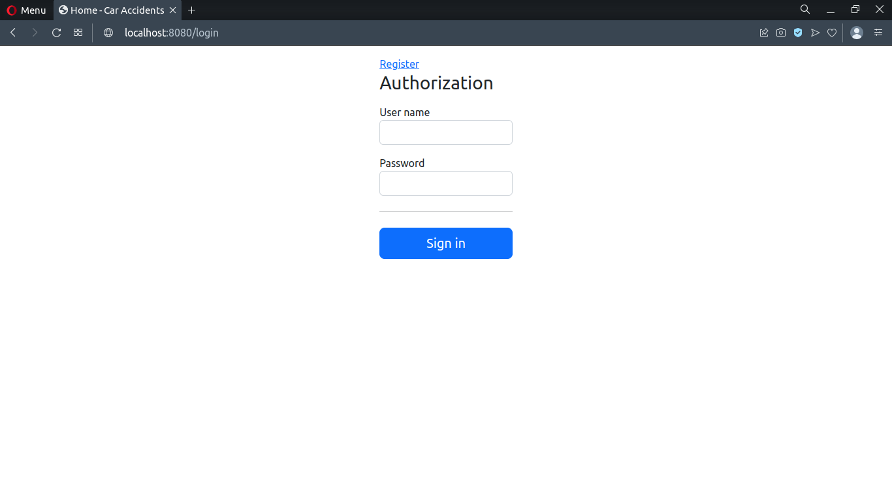
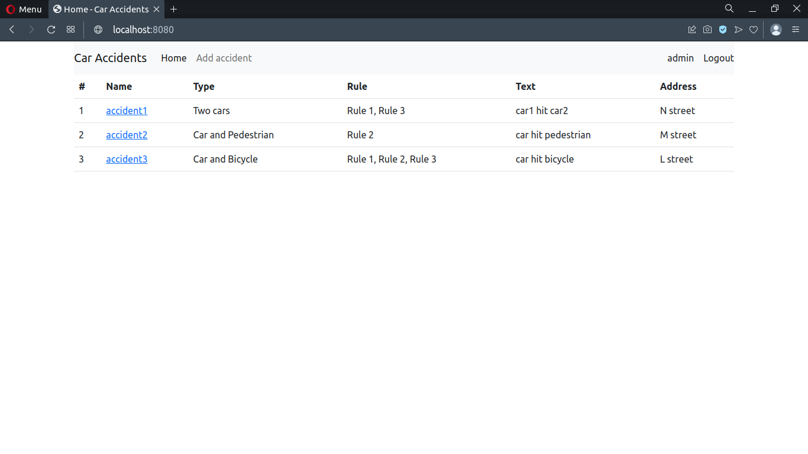
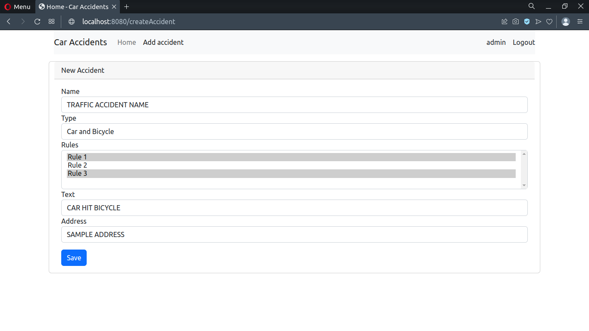
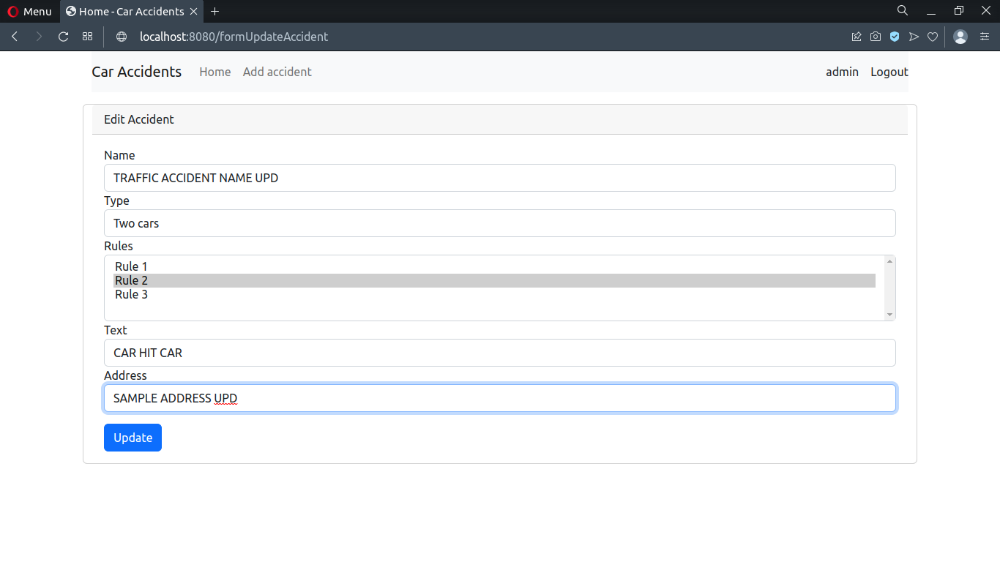

<h1>Job4j Accidents</h1>

Job4j Accidents is a web application that allows users to manage and track traffic accidents. It provides a platform for users to report accidents, view accident details, and perform various operations related to accidents, such as adding/editing accident records and assigning accident types. This project is built using the Java programming language and the Spring Framework.

<h2>Table of Contents</h2>

<ul>
  <li><a href="#features">Features</a></li>
  <li><a href="#technologies">Technologies</a></li>
  <li><a href="#getting-started">Getting Started</a></li>
  <li><a href="#usage">Usage</a></li>
  <li><a href="#screenshots">Screenshots</a></li>
  <li><a href="#contributing">Contributing</a></li>
  <li><a href="#license">License</a></li>
</ul>

<h2>Features</h2>

<ul>
  <li>User registration and authentication: Users can create an account and log in to the system.</li>
  <li>Accident reporting: Users can report new accidents by providing relevant details such as accident location, description, and participants involved.</li>
  <li>Accident management: Users can view a list of accidents, search for specific accidents, and perform actions like editing and deleting accident records.</li>
  <li>Accident types: The application provides a predefined set of accident types, and users can assign appropriate types to each accident.</li>
  <li>Statistics: The system generates various statistics and reports related to accidents, such as the total number of accidents, most common accident types, etc.</li>
</ul>

<h2>Technologies</h2>

The following technologies and frameworks are used in this project:

<ul>
  <li>Java</li>
  <li>Spring Framework (Spring Boot, Spring MVC, Spring Data JPA)</li>
  <li>Thymeleaf (Java-based templating engine)</li>
  <li>PostgreSQL (relational database)</li>
  <li>HTML/CSS (front-end)</li>
  <li>Maven (dependency management)</li>
  <li>JUnit (testing framework)</li>
  <li>Mockito (mocking framework for testing)</li>
</ul>

<h2>Getting Started</h2>

To get started with the Job4j Accidents project, follow these steps:

<ol>
  <li>Clone the repository: <code>git clone https://github.com/lenarsharipov/job4j_accidents.git</code></li>
  <li>Navigate to the project directory: <code>cd job4j_accidents</code></li>
  <li>Configure the database connection properties in the <code>src/main/resources/application.properties</code> file.</li>
  <li>Build the project using Maven: <code>mvn clean install</code></li>
  <li>Run the application: <code>mvn spring-boot:run</code></li>
  <li>Access the application in your web browser: <code>http://localhost:8080</code></li>
</ol>

Note: Make sure you have Java and Maven installed on your system.

<h2>Usage</h2>

Once you have the application up and running, you can access the various features through the web interface. Here are some key points to keep in mind:

<ul>
  <li>Register a new user account or log in with existing credentials.</li>
  <li>Use the provided forms to report new accidents, edit existing accidents, or assign accident types.</li>
  <li>View the list of accidents and use the search functionality to find specific accidents.</li>
  <li>Navigate through different sections of the application using the provided menus and links.</li>
  <li>Explore the statistics and reports generated by the system.</li>
</ul>

<h2>Screenshots</h2>

Here is a screenshot of the authorization page:

Here is a screenshot of the login page:

Here is a screenshot of the creating accident page:

Here is a screenshot of the updating accident page:

<h2>Contributing</h2>

Contributions to the Job4j Accidents project are welcome! If you have any ideas, improvements, or bug fixes, feel free to submit a pull request. Please make sure to follow the existing code style and provide clear commit messages.

<h2>License</h2>

This project is licensed under the <a href="LICENSE">MIT License</a>.

Please note that this is a sample README file, and you may need to customize it based on the specifics of your project.

